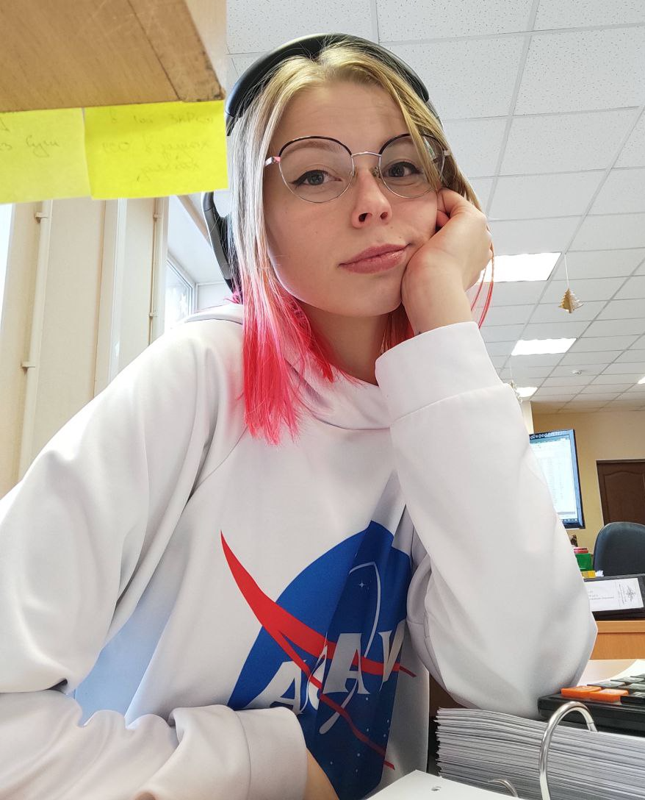

# My CV

1. Full name: Elvira Krutova
2. Contacts: +7(921)447-09-87, [Telegram](https://t.me/krasnoe_soInce), discord: Red Sun#5147
3. About me: The visual component attracts me the most in front-end development. Namely, that in the process of working on the layout, you can always see the result of your work.
My primary aim is to make accessible and beautiful products for users.
I like to be in a constant state of learning something new. I especially like to study what is the most difficult, as it motivates me.
4. Skills: I have knowledge of modern layout standards: block, cross-browser, fluid, adaptive; knowledge of HTML5 and CSS3; layouts using flexbox; Pixel perfect; work with Figma; knowledge of BEM principles; working with the Bootstrap framework; basic knowledge of JavaScript.
5. Code example: 
```javascript
function multiply(a, b){
  return a * b;
};

multiply(5, 9);
```
6. Work experience: At the moment I haven't commercial development experience. But I have a final educational project completed at the end of the course "Web Layout "Basic"" on Skillbox. The educational project was created using HTML5, CSS3 and JS.

[Link to source code on github](https://github.com/Elvira-del/blanchard-gallery)

[Link to project hosting](http://blanchard-gallery.tw-team.com/)

7. Education: Manager of State and Municipal Administration. At the moment I am taking courses in the profession of Front-end developer on Skillbox.
8. English level: A1.
